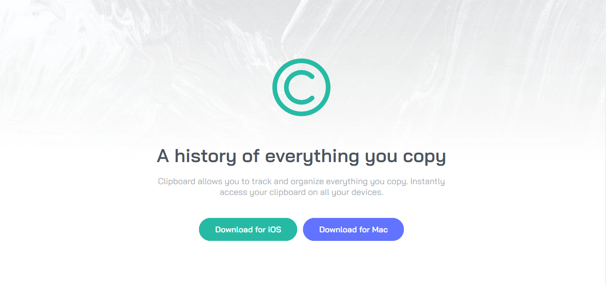

# Frontend Mentor - Clipboard landing page solution

This is a solution to the [Clipboard landing page challenge on Frontend Mentor](https://www.frontendmentor.io/challenges/clipboard-landing-page-5cc9bccd6c4c91111378ecb9). Frontend Mentor challenges help you improve your coding skills by building realistic projects.

## Table of contents

- [Overview](#overview)
  - [The challenge](#the-challenge)
  - [Screenshot](#screenshot)
  - [Links](#links)
- [My process](#my-process)
  - [Built with](#built-with)
- [Author](#author)

## Overview

### The challenge

Users should be able to:

- View the optimal layout for the site depending on their device's screen size
- See hover states for all interactive elements on the page

### Screenshot

### Links

- Solution URL: [https://www.frontendmentor.io/solutions/responsive-clipboard-landing-page-using-desktop-first-approach-sj8_uORRB](https://www.frontendmentor.io/solutions/responsive-clipboard-landing-page-using-desktop-first-approach-sj8_uORRB)
- Live Site URL: [https://sanketcharanpahadi.github.io/clipboard-landing-page/](https://sanketcharanpahadi.github.io/clipboard-landing-page/)

## My process

### Built with

- Semantic HTML5 markup
- CSS custom properties
- Flexbox

<!-- ### Continued development

Use this section to outline areas that you want to continue focusing on in future projects. These could be concepts you're still not completely comfortable with or techniques you found useful that you want to refine and perfect. -->

## Author

<!-- - Website - [Add your name here](https://www.your-site.com) -->

- Frontend Mentor - [@sanketcharanpahadi](https://www.frontendmentor.io/profile/sanketcharanpahadi)
<!-- - Twitter - [@yourusername](https://www.twitter.com/yourusername) -->
